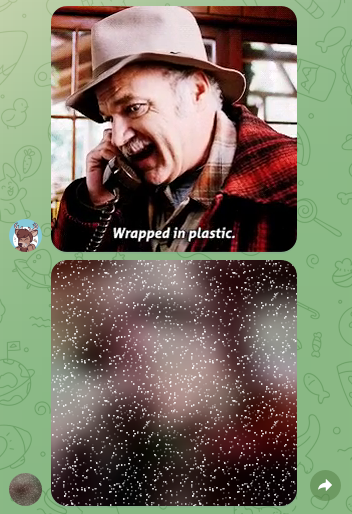

# TELEGRAM GIF SPOILERER

## Space Buck, January 2025

The Telegram API has the ability to send gifs with a spoiler tag. However, the desktop and mobile clients (as of the time of writing) do not expose an easy way for the user to send them. If you send a gif to this bot, it will send it back to you with the spoiler tag, and then you can forward it to whomever with that spoiler tag. It's the best workaround I could figure out for now.

It also works for photos and videos! But if you send it a group of photos/videos, the bot will separate them out. I think I know how to keep them grouped, but I have other things to be doing with my time.

If you want to try it out, ping me and I'll give you a link to my instance of the bot.

The bot will delete any media that it receives after two minutes. If the bot crashes before the media is deleted, it will stay there indefinitely (until the user deletes it themselves).This is my first Telegram bot and I have no idea how to make it good.

### Running the bot

Install the libraries in `requirements.txt`. Create a `.env` file in the same directory as `main.py` and put your Telegram Bot Token in there, e.g. `TOKEN=1470258369:XxXxXxXxXxXxXxXxXxXxXxXxXxXxXxXxXxX`. Run `main.py` as a one-off thing whenever you need it, or run it on a server, however you normally run things on your server, I dunno.